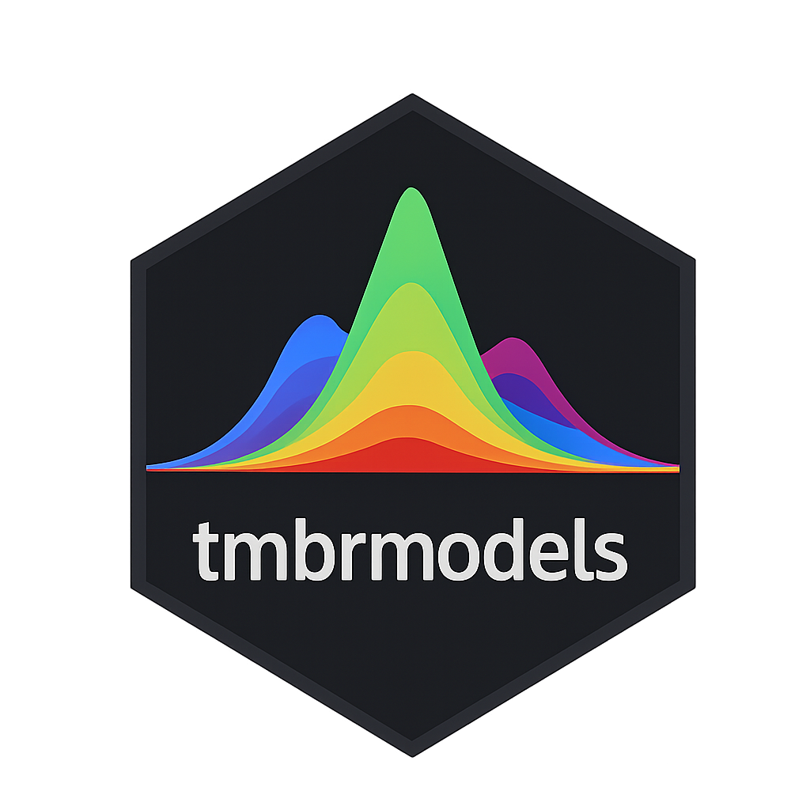

<p align="center">
  
</p>

# tmbrmodels

`tmbrmodels` is an R package designed to make the powerful **Template Model Builder (TMB)** engine accessible and easy to use for applied statisticians and researchers. It provides a high-level formula interface for common statistical models, allowing you to leverage TMB's speed and flexibility without writing or compiling C++ code yourself.


## The Motivation

TMB is an outstanding tool for fitting complex statistical models. However, its reliance on C++ templates can present a steep learning curve for those who primarily work in R. The process of writing the model syntax in C++, compiling it, and linking it within an R session can be a significant barrier.

`tmbrmodels` bridges this gap by providing a simple, formula-based interface that handles all the C++ and TMB complexity behind the scenes.


## Core Idea

This package uses the **Laplace Approximation**, a method that provides a fast and accurate Gaussian approximation to the posterior distribution of model parameters. This gives results that are "Bayesian-like" in their interpretation but are obtained with the speed of likelihood optimization.

## Installation

You can install the development version of `tmbrmodels` from GitHub with:

```r
# First, ensure you have the devtools package
# install.packages("devtools")

# Now, install tmbrmodels
# This will also install its dependencies, like TMB and lme4.
devtools::install_github("giovannitasso/tmbrmodels")

```

**Important Note:** Since this package compiles C++ code, you will need the appropriate development tools for your operating system:
* **Windows:** Install [Rtools](https://cran.r-project.org/bin/windows/Rtools/).
* **macOS:** Install the Command Line Tools by running `xcode-select --install` in your terminal.
* **Linux (Debian/Ubuntu):** Install `r-base-dev` and `build-essential` by running `sudo apt-get install r-base-dev build-essential`.

## Quick Start: Fitting a Binomial GLMM

Here is a complete example of how to simulate data and fit a Generalized Linear Mixed Model (GLMM) for a binary outcome.

```r
# 1. Load the library
library(tmbrmodels)

# 2. Simulate data
# We'll create a data frame, which is the standard for formula-based modeling in R.
set.seed(1234)
n_groups <- 10
n_per_group <- 30

sim_data <- data.frame(
  group = factor(rep(1:n_groups, each = n_per_group)),
  x = rnorm(n_groups * n_per_group)
)

# True parameter values
fixed_intercept <- -1.0
fixed_slope <- 1.5
sigma_intercept <- 1.0 # SD of random intercepts
sigma_slope <- 0.5     # SD of random slopes

# Simulate random effects for each group
random_intercepts <- rnorm(n_groups, 0, sigma_intercept)
random_slopes <- rnorm(n_groups, 0, sigma_slope)

# Calculate the linear predictor and response
eta <- (fixed_intercept + random_intercepts[sim_data$group]) + 
       (fixed_slope + random_slopes[sim_data$group]) * sim_data$x
       
p <- 1 / (1 + exp(-eta))
sim_data$y <- rbinom(nrow(sim_data), size = 1, prob = p)

# 3. Fit the model using the simple formula interface
# The complexity of creating design matrices is handled automatically!
fit <- tmbr(
  formula = y ~ x + (x | group), 
  data = sim_data,
  family = "binomial"
)

# 4. Print the results
print(fit)

```

### Expected Output

```
Laplace Approximation Fit from 'tmbrmodels'

Formula: Binomial GLMM
Optimizer status: relative convergence (4) 

Parameter Estimates:
                   Estimate Std. Error  z value Pr(>|z|)
(Intercept)         -1.1259     0.3649  -3.0855   0.0020
x                    1.6083     0.2224   7.2311   0.0000
sigma_(Intercept)    0.9588     0.2974   3.2239   0.0013
sigma_x              0.4011     0.2079   1.9293   0.0537
corr_(Intercept)_x   0.1523     0.4682   0.3253   0.7450

```
*Note: z values and p-values for variance components are often not interpreted in the same way as fixed effects.*


## Features

* **Formula Interface:** Fit complex models using the standard R formula syntax (e.g., `y ~ x + (x | group)`), just like in `lme4`.
* **Full Covariance Structure:** Estimates separate standard deviations for random effects and their correlations.
* **No C++ Required:** All the TMB C++ code is pre-built and handled internally.
* **Fast Estimation:** Leverages TMB's high-performance C++ backend for speed.


## Available Models

The main `tmbr()` function uses the `family` argument to select the model:

* **`family = "binomial"`**
    * **Model:** Generalized Linear Mixed Model (GLMM) for binary (0/1) outcomes.
    * **Link Function:** `logit`
    * **Random Effects:** Supports full covariance structures for intercepts and slopes (e.g., `(x | group)`).


## Contributing

Feedback, bug reports, and feature requests are welcome! Please open an issue on the [GitHub repository issues page](https://github.com/giovannitasso/tmbrmodels/issues).


